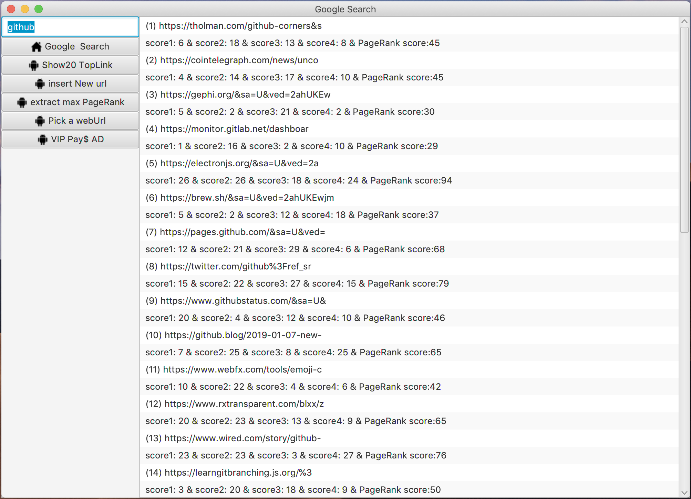
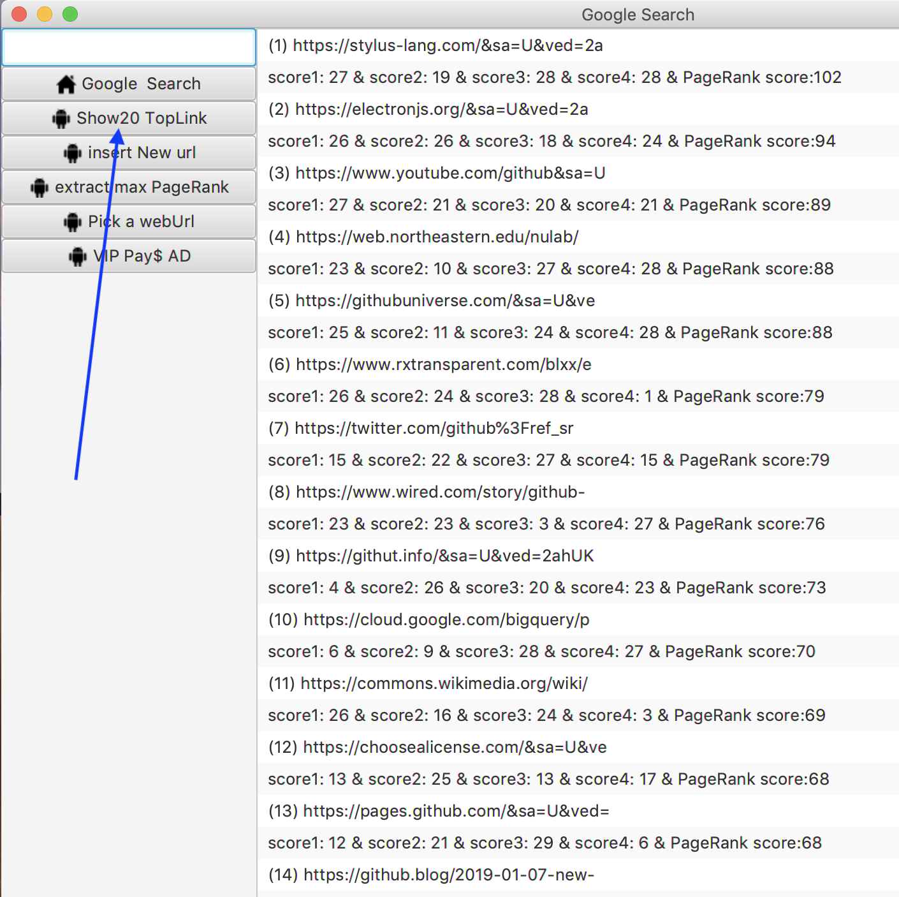
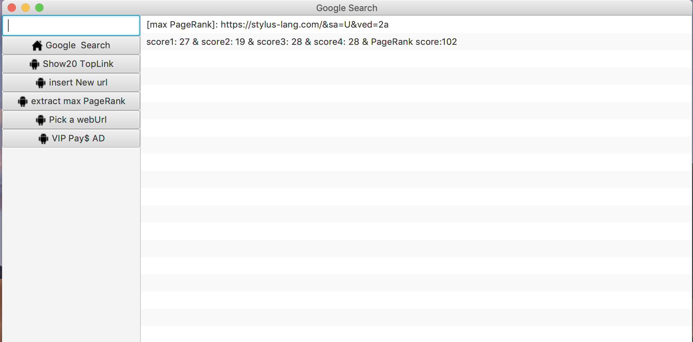
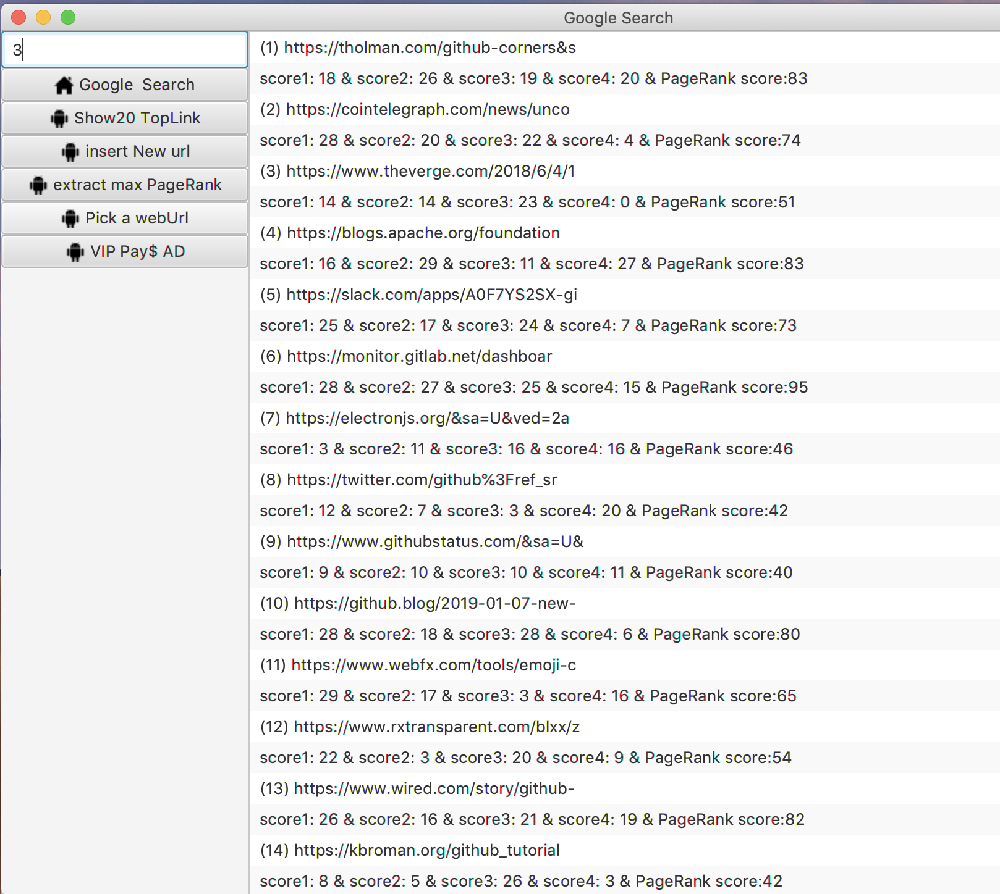

# Google Search Engine Simulation
## Data Structures and Algorithms
### Base on HeapSort
### By using Web Crawler to get the web address
### import javaFX library
#### *More details you can see in my report*
---
- Max-Heapify()        ------>  O(lg n)
- Build-Max-Heap()    ------>  O(n)
- Heapsort() ------>  O(nlg n)
- Max-Heap-Insert() ------>  O(lg n)
- Heap-Extract-Max ------>  O(n)
- Heap-Increase-Key------>  O(lg n)
- Heap-Maximum------>  O(1)
---
1. Enter the keyword:  

2. click button 'Google Search'

3. show top 20 link:

4. insert a new URL address

5. get the URL address which has the max PageRank

6. the user may pick a desired URL address

7. the user can increase the PageRank 
